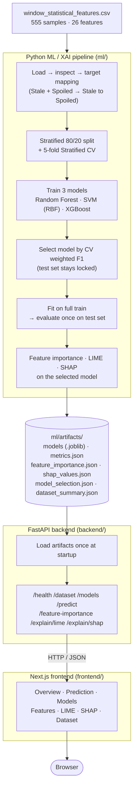

# 🍅 Tomato Freshness Classification + Explainable AI

A full-stack machine learning system that classifies tomato freshness from
gas-sensor and environmental readings, and explains every prediction with
feature importance, **LIME**, and **SHAP**.

It has three parts: a Python ML/XAI pipeline, a FastAPI backend that serves
the trained models, and a Next.js dashboard for exploring the data, models,
predictions, and explanations interactively.


---

## What this project does

Tomatoes decay along a continuum from freshly harvested to spoiled, and
judging that stage by hand is slow and subjective. This project automates it:
six MQ gas sensors (MQ2, MQ3, MQ9, MQ135, MQ136, MQ138) plus temperature and
humidity are logged over an observation window per sample, reduced to 26
statistical features (mean / std / slope per sensor, plus two sensor ratios),
and fed into a classifier trained to predict one of three freshness classes:

| Class | Meaning |
|---|---|
| **Pure Fresh** | Just harvested |
| **Good** | Still edible, past peak freshness |
| **Stale to Spoiled** | Past the point of use (the raw dataset's separate `Stale` and `Spoiled` labels are merged into this one class) |

Beyond predicting the class, the project answers *why* the model predicted
it — both globally (which sensor signals matter most overall) and locally
(why this one reading was classified this way) — so the system is auditable
rather than a black box.

## Dataset

- **Source:** `data/window_statistical_features.csv`
- **555 samples**, **26 numeric features**, 0 missing values, 0 duplicates
- Original 4-class labels merged into the 3 required classes:

  | Original label | Count | → Mapped to |
  |---|---:|---|
  | Pure Fresh | 69 | Pure Fresh |
  | Good | 144 | Good |
  | Stale | 126 | Stale to Spoiled |
  | Spoiled | 216 | Stale to Spoiled |

  Mapped distribution: **Pure Fresh 69 · Good 144 · Stale to Spoiled 342**
  (imbalanced — this is why every split/evaluation below is stratified).
- **Split:** stratified 80/20 → 444 training / 111 held-out test samples.

## Models and results

Three supervised classifiers were trained as `Imputer(→Scaler)→Estimator`
scikit-learn pipelines: **Random Forest**, **SVM (RBF kernel)**, and
**XGBoost**. Model selection (which model gets used for feature importance,
LIME, and SHAP) is based **only on 5-fold stratified cross-validation on the
training set** — the held-out test set is never touched until final
evaluation, so it stays an unbiased check rather than a selection input.

**Cross-validation results** (training set, 5-fold stratified, mean ± std):

| Model | CV F1 (weighted) | CV Accuracy |
|---|---:|---:|
| **Random Forest** ⭐ | **0.9889 ± 0.0121** | **0.9888 ± 0.0123** |
| XGBoost | 0.9865 ± 0.0131 | 0.9865 ± 0.0131 |
| SVM (RBF) | 0.9750 ± 0.0195 | 0.9752 ± 0.0194 |

⭐ **Random Forest** was selected for the explainability analysis — highest
mean CV weighted F1.

**Final test results** (111 held-out samples, evaluated once, after
selection):

| Model | Accuracy | Precision | Recall | F1-score |
|---|---:|---:|---:|---:|
| Random Forest | 99.10% | 99.13% | 99.10% | 99.10% |
| SVM | 98.20% | 98.31% | 98.20% | 98.21% |
| XGBoost | 100.00% | 100.00% | 100.00% | 100.00% |

All three models score very highly, and CV scores track test scores closely
(no leakage). With only 111 test samples, treat these as strong but
small-sample results — the CV standard deviations are the more honest
estimate of variance. `report/report.md` has the full writeup, including an
investigation into *why* scores are this high and a documented dataset
limitation (no group/session identifier to rule out correlated sensor
windows).

### Explainability

| Method | Scope | What it shows |
|---|---|---|
| **Feature importance** | Global | Native `feature_importances_` of the selected model |
| **SHAP** | Global + local | Game-theoretic (Shapley value) attribution per feature, per prediction |
| **LIME** | Local | Local surrogate model around one prediction |

Top predictive features (Random Forest, native importance) — dominated by
gas-sensor **means** and the two engineered **ratio** features:

1. `MQ135_mean` (0.164)
2. `MQ138_mean` (0.129)
3. `MQ136_over_MQ138_end` (0.121)
4. `MQ3_over_MQ2_end` (0.106)
5. `MQ136_mean` (0.095)

Feature importance/SHAP describe **predictive contribution, not causation** —
a high-ranked gas reading is associated with a class, it isn't shown to cause
spoilage. All exact numbers are generated by `ml/run_pipeline.py`, never
hand-typed.

---

## Architecture



- **ML logic never runs outside Python.** The backend only loads what
  `run_pipeline.py` saved; the frontend only renders what the backend
  returns as JSON — no model, LIME, or SHAP computation happens in
  TypeScript/the browser.
- The **test set is locked** until after model selection (see `report/report.md`
  §3 and the regression test in `tests/test_model_selection.py`).
- Full request/response reference: [API endpoints](#api-endpoints) below.

---

## Tech stack

| Layer | Technology |
|---|---|
| **ML / XAI** | Python 3.11+, pandas, NumPy, scikit-learn, XGBoost, LIME, SHAP, matplotlib/seaborn, joblib |
| **Backend** | FastAPI, Pydantic, Uvicorn |
| **Frontend** | Next.js 16 (App Router), React 19, TypeScript, Tailwind CSS 4, Recharts, Lucide icons |
| **Testing** | pytest (backend + ML), TypeScript/ESLint (frontend) |

## Project structure

```text
data/                   dataset CSV
ml/
  src/                  pipeline modules: data_loader, preprocessing, models,
                         evaluation, feature_importance, lime_explainer,
                         shap_explainer, visualization
  run_pipeline.py        single entry point that runs the full pipeline
  outputs/figures/        generated plots (PNG)
  outputs/results/        generated metrics tables / classification reports
  artifacts/              saved models (.joblib) + JSON artifacts for the backend
backend/
  main.py                FastAPI app, CORS, startup loading, error handling
  api/                    routers: dataset, models, predict, explanations
  services/               model_service (artifacts + predictions), lime_service, shap_service
frontend/
  app/                    pages (Overview, Prediction, Models, Features, LIME, SHAP, Dataset)
  components/             layout, charts, UI primitives
  lib/                    typed API client, types, utils
report/                 written report (introduction → conclusion, references the generated figures)
tests/                  pytest suite (model-selection regression tests + full API tests)
architecture.md         detailed architecture spec
design.md               frontend visual design spec
```

---

## Requirements

- **Python 3.11+** (developed/tested on 3.13)
- **Node.js 20+** and npm (developed/tested on Node 26)
- **macOS only:** XGBoost needs the OpenMP runtime, which isn't bundled —
  install it once with `brew install libomp` (not needed on Linux/Windows)
- ~200 MB free disk space for the Python virtual environment + `node_modules`

## Getting started

### 1. Clone and set up Python

```bash
git clone https://github.com/JohnJomi/Tomato-Freshness-Classification-Explainable-AI.git
cd Tomato-Freshness-Classification-Explainable-AI

python3 -m venv .venv
source .venv/bin/activate        # Windows: .venv\Scripts\activate
pip install -r requirements.txt
pip install -r backend/requirements.txt
```

> **macOS:** if `import xgboost` fails, run `brew install libomp` once.

### 2. Run the ML pipeline

Trains all three models, runs the XAI analysis, and saves everything the
backend needs — required once before starting the API:

```bash
python ml/run_pipeline.py
```

This regenerates `ml/outputs/` (figures, metrics) and `ml/artifacts/`
(trained models + JSON) from scratch. Safe to rerun any time — it's fully
reproducible (`random_state=42` throughout).

### 3. Start the backend (FastAPI)

```bash
uvicorn backend.main:app --reload --port 8000
```

Interactive API docs at http://localhost:8000/docs. If port 8000 is taken,
pass another `--port` (and update `NEXT_PUBLIC_API_URL` below to match).

### 4. Start the frontend (Next.js)

In a second terminal:

```bash
cd frontend
npm install
cp .env.example .env.local   # edit NEXT_PUBLIC_API_URL if the backend isn't on :8000
npm run dev
```

Open **http://localhost:3000**.

### All four steps at once

```bash
source .venv/bin/activate
python ml/run_pipeline.py                          # 1. train + save artifacts
uvicorn backend.main:app --port 8000 &              # 2. API on :8000
cd frontend && npm install && npm run dev           # 3. UI on :3000
```

## Running the tests

```bash
source .venv/bin/activate
python -m pytest
```

Covers: the model-selection regression test (proves selection uses CV
scores, not test scores — see `tests/test_model_selection.py`) and the full
backend API test suite (predictions, LIME/SHAP, validation, error handling —
`tests/test_api.py`, `tests/test_api_degraded.py`). The API tests need
`ml/artifacts/` to exist first (step 2 above); they skip cleanly if it
doesn't.

Frontend checks:

```bash
cd frontend
npx tsc --noEmit
npm run lint
npm run build
```

---

## API endpoints

Models and explainers are loaded once at startup — nothing is retrained per
request. If `ml/artifacts/` is missing, the server still starts, `/health`
reports `"degraded"`, and the other endpoints return a 503 that names the
missing step instead of crashing.

| Method | Endpoint | Returns |
|---|---|---|
| GET | `/health` | status + the CV-selected XAI model |
| GET | `/dataset` | sizes, classes, class distribution, per-feature stats |
| GET | `/dataset/samples` | held-out test samples (index + actual class) |
| GET | `/dataset/samples/{index}` | one test sample's 26 feature values |
| GET | `/models` | test metrics, CV mean/std, confusion matrix per model, selection metadata |
| POST | `/predict` | `{features, model?}` → predicted class, confidence, probabilities |
| GET | `/feature-importance` | ranked features for the CV-selected model |
| POST | `/explain/lime` | `{features}` or `{sample_index}` → local LIME contributions |
| POST | `/explain/shap` | `{features}` or `{sample_index}` → per-class SHAP values + base values |
| GET | `/explain/shap/global?class_name=` | global mean \|SHAP\| + beeswarm points |

`/predict` validates that exactly the 26 expected features are present and
finite, and defaults to the CV-selected model. The explanation endpoints
always use the CV-selected model and label each response `local` or
`global`. CORS allows `http://localhost:3000` by default; override with
`FRONTEND_ORIGINS=http://host:port,...`.

## Frontend pages

| Route | Page |
|---|---|
| `/` | Overview — dataset size, selected model, test metrics, model comparison, class distribution |
| `/predict` | Prediction Playground — 26 grouped sensor inputs, model choice, live probabilities |
| `/models` | Sortable metrics table, dot-plot comparison, three confusion matrices |
| `/features` | Feature importance (model importance or mean \|SHAP\|) |
| `/explain/lime` | Local LIME explanation for a test sample or your own Playground values |
| `/explain/shap` | Global SHAP importance + beeswarm, plus a local explanation |
| `/dataset` | Sizes, target mapping, missing-value check, per-feature statistics |

The UI only calls the API — no ML logic runs in TypeScript. If the backend
is unreachable, pages show "Unable to connect to the ML service" with a
retry button instead of a blank screen or a stack trace.

---

## Documentation

- [`architecture.md`](architecture.md) — full architecture specification (pipeline, evaluation, XAI, API, full-stack design)
- [`design.md`](design.md) — frontend visual design specification
- [`report/report.md`](report/report.md) — the written report: introduction, dataset, methodology, results, feature importance, LIME, SHAP, conclusion and limitations

## Reproducibility & methodology notes

- `random_state=42` everywhere it's supported.
- Model selection uses **training-set 5-fold CV only** — never the test set
  (enforced by `tests/test_model_selection.py`).
- All preprocessing runs inside scikit-learn `Pipeline`s, fit only on
  training folds during CV — no leakage into validation/test data.
- No numerical result in this README, the report, or the UI is hand-typed;
  everything traces back to `ml/run_pipeline.py`'s output.
