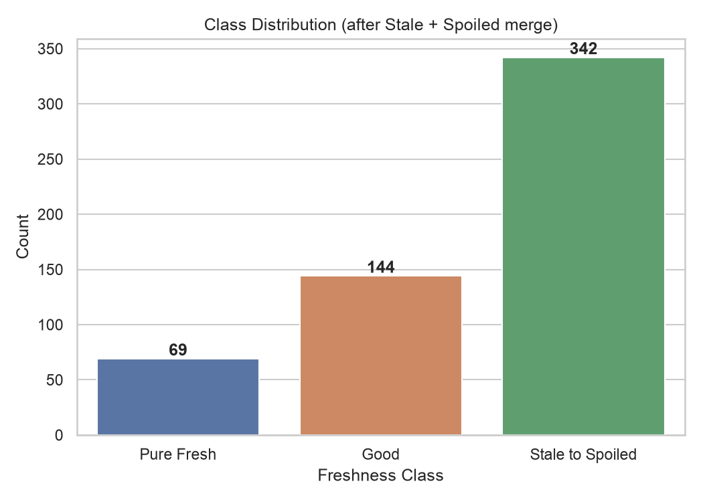
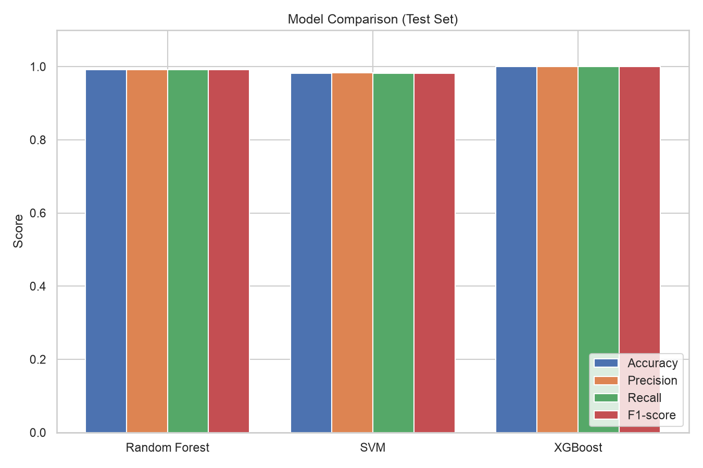
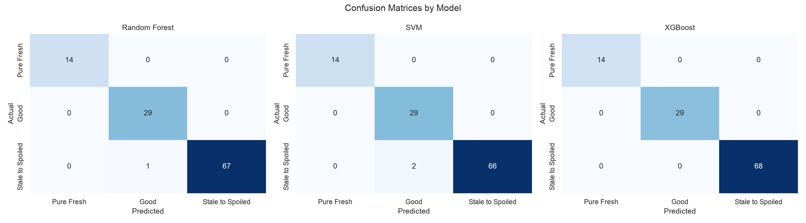
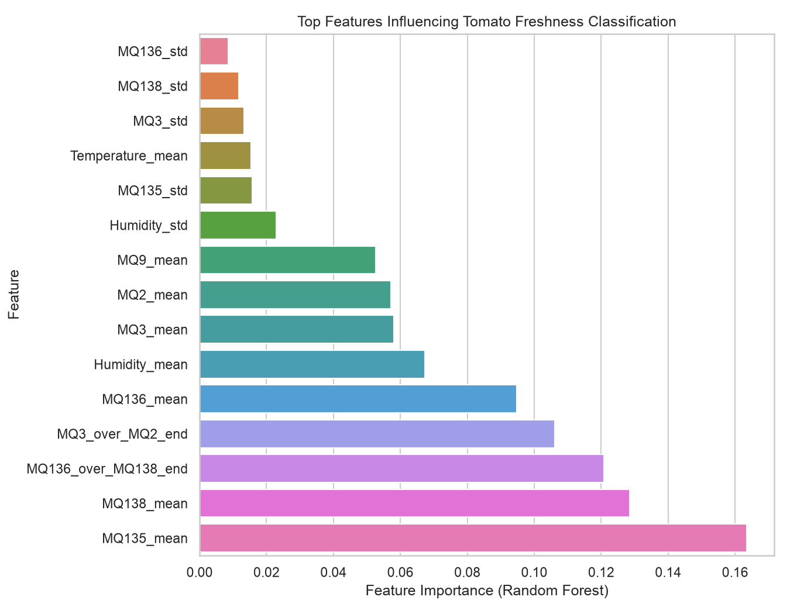
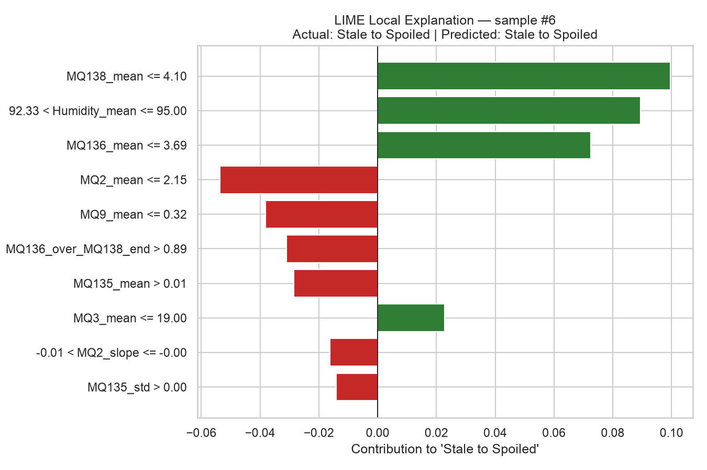
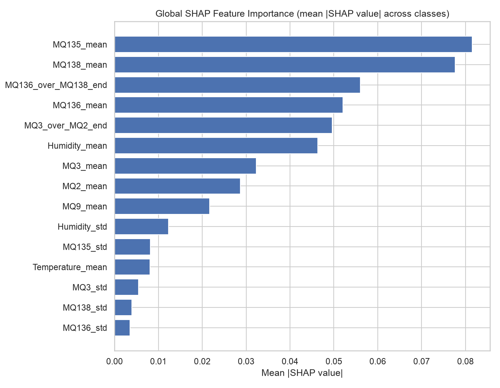
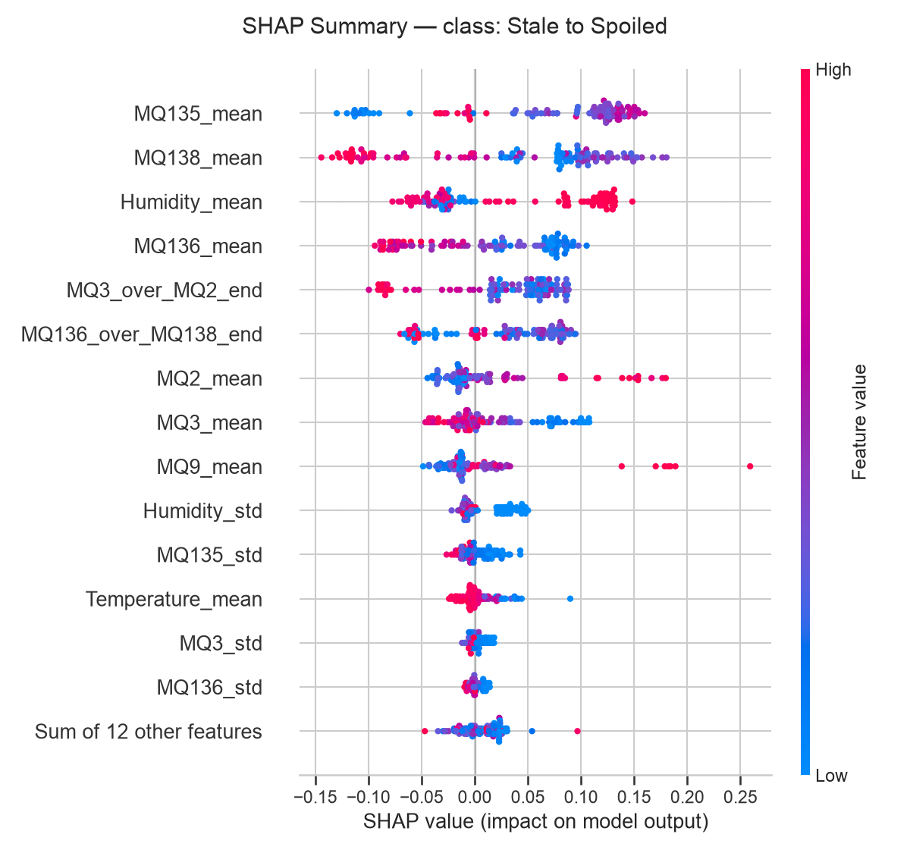
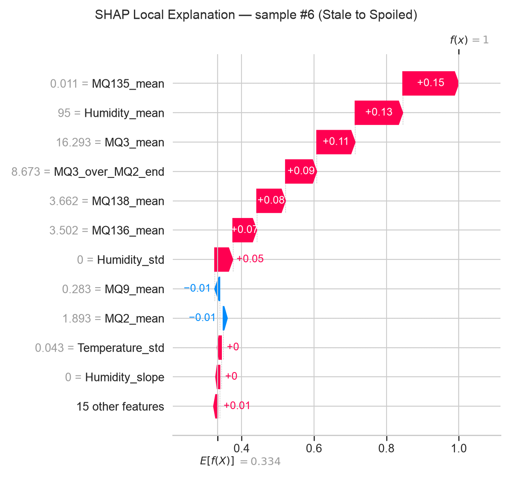

# Tomato Freshness Classification + Explainable AI — Report

## 1. Introduction

Tomatoes deteriorate through a continuum from freshly harvested to spoiled,
and the point at which produce should be pulled from a supply chain is
normally judged by manual inspection — slow, subjective, and hard to scale.
This project builds a supervised machine learning system that classifies
tomato freshness automatically from time-windowed statistics of six gas
sensors (MQ2, MQ3, MQ9, MQ135, MQ136, MQ138) plus temperature and humidity,
into three classes: **Pure Fresh**, **Good**, and **Stale to Spoiled**.

Beyond raw predictive accuracy, the project also asks *why* the model makes
a given prediction. Gas-sensor classifiers are easy to distrust as "black
boxes," so alongside three classifiers (Random Forest, SVM, XGBoost) the
project applies explainable AI (XAI) — native feature importance, LIME, and
SHAP — so predictions can be inspected and reasoned about rather than taken
on faith.

## 2. Dataset and Preprocessing

- **Source:** `data/window_statistical_features.csv`
- **Size:** 555 samples, 26 numeric input features, 1 target column
  (`Freshness_Level`)
- **Features:** for each of the 6 MQ gas sensors — `mean`, `std`, `slope`
  over the observation window; for Temperature and Humidity — the same
  `mean`/`std`/`slope` triplet; plus two derived ratio features,
  `MQ3_over_MQ2_end` and `MQ136_over_MQ138_end`.
- **Missing values / duplicates:** none observed (0 missing, 0 duplicate
  rows). A `SimpleImputer(strategy="median")` is still included in every
  model pipeline so the pipeline stays robust if missing values appear in
  future data.

**Original labels → required 3-class mapping.** The raw dataset carries four
labels:

| Label | Count |
|---|---:|
| Spoiled | 216 |
| Good | 144 |
| Stale | 126 |
| Pure Fresh | 69 |

`Stale` and `Spoiled` are merged into a single class, `Stale to Spoiled`,
giving the three required classes:

| Class | Count | Share |
|---|---:|---:|
| Pure Fresh | 69 | 12.4% |
| Good | 144 | 25.9% |
| Stale to Spoiled | 342 | 61.6% |

The mapped dataset is imbalanced (Pure Fresh is the minority class at ~12%
of samples), which is why stratification is used throughout — both for the
train/test split and for cross-validation — and why the report tracks
macro-averaged F1 alongside the weighted metrics (Section 4).

**Train/test split:** stratified 80/20 (`train_test_split`,
`stratify=y`, `random_state=42`) → 444 training / 111 test samples, with
class proportions preserved in both.

**Scaling:** each model is wrapped in an sklearn `Pipeline` combining an
imputer (and, for SVM, a `StandardScaler`) with the estimator, so
preprocessing is fit only on training folds during cross-validation — never
on the held-out data.

**Cross-validation:** Stratified 5-fold CV (`StratifiedKFold(n_splits=5,
shuffle=True, random_state=42)`) is run on the training set only, before any
test-set evaluation.

## 3. Methodology

Three supervised classifiers were trained and compared:

- **Random Forest** (`n_estimators=200`, `class_weight="balanced"`) — an
  ensemble of decision trees; handles nonlinear feature interactions well
  and needs little preprocessing.
- **SVM (RBF kernel)** (`class_weight="balanced"`, `probability=True`) — fit
  on imputed + standardized features; effective on datasets of this size
  (555 samples) with nonlinear class boundaries.
- **XGBoost** (`multi:softprob`, `n_estimators=200`, `max_depth=4`,
  `learning_rate=0.05`, `subsample=0.8`, `colsample_bytree=0.8`) — gradient-
  boosted trees, generally strong on structured/tabular sensor data.

For each model: 5-fold stratified CV on the training set (to estimate
generalization and variance before touching the test set), then a single
fit on the full training set and one evaluation on the untouched test set.
Metrics are accuracy, and weighted precision/recall/F1 (`average="weighted"`,
required by the assignment); macro-F1 is also reported to surface how the
minority `Pure Fresh` class performs, since weighted metrics can mask
under-performance on a small class. `random_state=42` is fixed everywhere
it's supported, so the experiment is reproducible end-to-end via
`ml/run_pipeline.py`.

**Model selection.** Model selection was performed using the mean weighted
F1-score obtained through 5-fold stratified cross-validation on the training
data, with mean CV accuracy as a tie-breaker. The held-out test set was
reserved for final evaluation. The pipeline enforces this order: CV runs for
all three models, the selection is made from those scores alone, and only then
is each model fit on the full training set and scored once on the test set
(`ml/run_pipeline.py`; selection logic in `select_model_for_xai()`,
`ml/src/feature_importance.py`; decision recorded in
`ml/artifacts/model_selection.json` with `"test_set_used_for_selection":
false`). The selected model is then used for feature importance, LIME, and
SHAP. Nothing about the choice is hard-coded, and a regression test
(`tests/test_model_selection.py`) checks that a model with a better CV score
but a worse test score is still the one chosen.

## 4. Results and Discussion

**Cross-validation results** (training set only, 5-fold stratified, mean ±
std). These scores were used for model comparison during development and for
model selection:

| Model | CV F1-weighted | CV Accuracy |
|---|---:|---:|
| **Random Forest** | **0.9889 ± 0.0121** | **0.9888 ± 0.0123** |
| SVM | 0.9750 ± 0.0195 | 0.9752 ± 0.0194 |
| XGBoost | 0.9865 ± 0.0131 | 0.9865 ± 0.0131 |

**Random Forest was selected for the explainability analysis based on its
cross-validation performance** (highest mean CV weighted F1, 0.9889). Its
final performance, and that of the other two models, was then evaluated on
the held-out test set.

**Final test results** (111 held-out samples, evaluated once after
selection, for unbiased final evaluation only):

| Model | Accuracy | Precision | Recall | F1-score | F1-macro |
|---|---:|---:|---:|---:|---:|
| Random Forest | 0.9910 | 0.9913 | 0.9910 | 0.9910 | 0.9919 |
| SVM | 0.9820 | 0.9831 | 0.9820 | 0.9821 | 0.9839 |
| XGBoost | 1.0000 | 1.0000 | 1.0000 | 1.0000 | 1.0000 |

All three models score highly, and CV scores track test scores closely.
XGBoost classified every one of the 111 test samples correctly, even though
its CV score was slightly below Random Forest's. The gap between them (0.9865
vs 0.9889 CV F1) is smaller than either model's CV standard deviation, so the
two are statistically hard to tell apart on this data. The test result does
not change the selection, because the test set is not a selection input.
Random Forest's only test error was one `Stale to Spoiled` sample predicted
as `Good`. SVM made two errors of the same kind. No model confused
`Pure Fresh` with either other class.

**Investigating the very high scores.** The 100% XGBoost result was
investigated, not adjusted. The dataset has no tomato, recording, session,
batch, or sequence identifier: its 27 columns are the target plus 26 sensor
statistics. The row order does show structure, though. The rows form exactly
four contiguous blocks, one per original label (rows 0–68 Pure Fresh, 69–212
Good, 213–338 Stale, 339–554 Spoiled). Consecutive rows within a block are
much closer to each other than random rows of the same class: the mean
Euclidean distance over standardized features is 2.41 for neighbours vs 6.11
for random same-class pairs, about 2.5× apart. This fits the file name
(`window_statistical_features`): rows may be overlapping or adjacent time
windows cut from continuous sensor recordings. If so, a random split can put
near-identical neighbouring windows in both train and test, which would
inflate the scores. There is no identifier to group on, and making up groups
from row order would be guesswork, so the stratified random split and
stratified CV were kept. This is recorded as a limitation (Section 8), not as
confirmed leakage.

Also worth noting: there are only 111 test samples (14 of them `Pure Fresh`),
so a few different samples could shift these numbers noticeably. The CV
standard deviations (up to about 2 points of accuracy) give a better sense of
the variance than the single test-set figure.

## 5. Feature Importance

Model used: **Random Forest** (selected by CV, see Section 3). Method: native
impurity-based `feature_importances_`, as saved in
`ml/artifacts/feature_importance.json`.

| Rank | Feature | Importance |
|---:|---|---:|
| 1 | MQ135_mean | 0.1635 |
| 2 | MQ138_mean | 0.1285 |
| 3 | MQ136_over_MQ138_end | 0.1207 |
| 4 | MQ3_over_MQ2_end | 0.1061 |
| 5 | MQ136_mean | 0.0947 |
| 6 | Humidity_mean | 0.0673 |
| 7 | MQ3_mean | 0.0580 |
| 8 | MQ2_mean | 0.0572 |
| 9 | MQ9_mean | 0.0525 |
| 10 | Humidity_std | 0.0228 |

The ranking is led by gas-sensor **means** (MQ135, MQ138, MQ136) and the two
**ratio** features, followed by mean humidity. The `std` and `slope` features
rank lower. This is consistent with average gas concentration over a window
shifting as volatile compounds change with ripening and spoilage, while
within-window variability adds less. The high rank of both ratio features
suggests that relative sensor responses are informative, possibly because a
ratio cancels some shared drift between sensors.

**Feature importance indicates predictive contribution, not causation.** It
shows which features the model relies on to separate the classes. It does not
show that any gas causes spoilage.

## 6. LIME Analysis

LIME explains one individual test prediction from the CV-selected Random
Forest. The sample was chosen only for explanation, as a correctly classified
and confident prediction. Choosing it did not affect the model in any way.

- **Sample:** test index #6
- **Actual class:** Stale to Spoiled
- **Predicted class:** Stale to Spoiled
- **Probabilities:** Pure Fresh 0.00, Good 0.00, Stale to Spoiled 1.00

Features that pushed this prediction **toward** `Stale to Spoiled`:
`MQ138_mean <= 4.10` (+0.100), `92.33 < Humidity_mean <= 95.00` (+0.090),
`MQ136_mean <= 3.69` (+0.072), and `MQ3_mean <= 19.00` (+0.023). Features
that pushed **against** it: `MQ2_mean <= 2.15` (−0.054), `MQ9_mean <= 0.32`
(−0.038), `MQ136_over_MQ138_end > 0.89` (−0.031), and `MQ135_mean > 0.01`
(−0.029). The prediction still ends at probability 1.0 because the supporting
evidence outweighs the opposing evidence.

LIME is a **local explanation**. It fits a simple surrogate model around this
one sample, so it explains why the model classified this particular reading
as it did. It is not a global description of how the model behaves.

## 7. SHAP Analysis

SHAP was applied to the same CV-selected Random Forest using
`shap.TreeExplainer`. For this sklearn Random Forest, SHAP values are in class
**probability** units.

**Global SHAP feature importance** (mean |SHAP value| over all test samples
and all three classes):

The global SHAP ranking is `MQ135_mean` (0.082), `MQ138_mean` (0.078),
`MQ136_over_MQ138_end` (0.056), `MQ136_mean` (0.052), `MQ3_over_MQ2_end`
(0.050), `Humidity_mean` (0.046). Its top six features are the same six as
the Random Forest `feature_importances_` ranking in Section 5, in nearly the
same order. That agreement is a useful check, because the two methods measure
importance in different ways (impurity reduction vs. Shapley attribution).

**SHAP summary (beeswarm) for the `Stale to Spoiled` class:**

This plot adds direction: it shows, for each feature, whether high or low
values push predictions toward or away from `Stale to Spoiled`, and how
widely that effect varies across samples.

**Local explanation for the same sample used by LIME (#6):**

SHAP moves this sample from the baseline `E[f(X)] = 0.334` (the average
`Stale to Spoiled` probability) to `f(x) = 1.0`. The largest contributions are
`MQ135_mean` (+0.155), `Humidity_mean` (+0.132), `MQ3_mean` (+0.106),
`MQ3_over_MQ2_end` (+0.086), `MQ138_mean` (+0.080), and `MQ136_mean`
(+0.066).

**LIME vs SHAP on sample #6.** Both methods rank `Humidity_mean`,
`MQ138_mean`, and `MQ136_mean` among the main drivers toward
`Stale to Spoiled`. They disagree on `MQ135_mean`: SHAP gives it the largest
positive contribution, while LIME gives it a small negative weight. This kind
of disagreement is expected. LIME assigns weights to discretized value ranges
using a surrogate fit on perturbed samples, while TreeExplainer computes exact
attributions from the trees themselves. SHAP's local attributions are the
more faithful of the two for tree models. The disagreement is a reminder not
to over-read any single local explanation.

As with feature importance, SHAP describes how features **moved this
prediction away from the model's baseline**. It does not show that those gas
readings caused the tomato to spoil.

## 8. Conclusion

All three classifiers perform strongly (98–100% test accuracy). **Random
Forest was selected for the explainability analysis based on its
cross-validation performance** (mean CV weighted F1 0.9889, ahead of XGBoost
at 0.9865 and SVM at 0.9750). On the held-out test set it reached 99.1%
accuracy, and XGBoost reached 100%. The held-out test set was used only for
this final evaluation. The most predictive signals are the MQ135, MQ138, and
MQ136 gas-sensor means, the MQ136/MQ138 and MQ3/MQ2 ratios, and mean
humidity. Feature importance and global SHAP agree closely on this ranking.
LIME and SHAP agree on some local drivers and differ on others, which shows
why local explanations should be read with care.

**Limitations:**
- **Possible correlated windows.** The dataset does not provide an explicit
  tomato, recording, or session identifier, so a group-aware split could not
  be performed. If multiple rows come from the same underlying recording,
  random splitting may put correlated samples in both the training and test
  sets. The row order suggests this is plausible: rows are grouped in one
  contiguous block per label, and neighbouring rows are about 2.5× more
  similar than random same-class pairs. It is not proven, and the reported
  scores may be optimistic if it is true.
- The dataset is small (555 samples, 111 in the test set) and imbalanced
  (69 `Pure Fresh`), so the near-perfect test scores should be read alongside
  the CV standard deviations.
- Feature importance and SHAP show association and predictive contribution,
  not causal mechanisms of spoilage.
- No hyperparameter tuning was done, by design. The numbers reflect the
  configurations specified in the architecture.

**Possible future improvements:** record a tomato or recording identifier with
each window so that `StratifiedGroupKFold` and a group-aware test split can
be used. This is the most important step for confirming whether these scores
generalize. Other steps: collect more `Pure Fresh` samples and data from
additional sensor units or batches, add light hyperparameter tuning inside CV,
and extend the XAI analysis to misclassified samples.

---
*All figures and numbers in this report are generated by
`ml/run_pipeline.py` from the actual dataset — nothing here is fabricated.
Rerun with `python ml/run_pipeline.py` to reproduce.*
